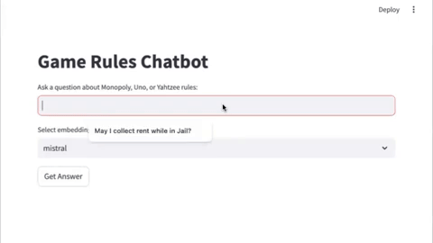

# Game Rules AI Chatbot 

The Game Rules AI Chatbot is designed to provide specialized knowledge 
on the rules of Monopoly, Uno, and Yahtzee. Users can ask it questions about 
these games, and the chatbot will retrieve accurate answers. It leverages PDFs as 
information sources and employs Retrieval Augmented Generation (RAG) using the 
powerful large language model (LLM), Ollama, to process and respond to queries effectively.

  

##  Technologies
* Python
* Ollama
* Chroma
* LangChain
* pypdf
* Streamlit

## Features

This project implements a comprehensive Retrieval Augmented Generation (RAG) chatbot that provides accurate, source-backed answers about the rules of Monopoly, Uno, and Yahtzee. The system leverages local PDF documents as its knowledge base and employs a sophisticated pipeline to ensure responses are grounded in official game rules rather than potentially outdated training data from large language model training sets.

The architecture consists of five interconnected components that create a robust question-answering system. PDF Processing uses pypdf to extract raw text content from game rule PDFs, preserving document structure and metadata including page numbers and source filenames for complete traceability. Vector Database Storage employs Chroma as a persistent vector store that indexes document chunks alongside their high-dimensional embeddings, enabling lightning-fast semantic similarity searches across thousands of rule segments without requiring exact keyword matches. RAG Pipeline Integration utilizes LangChain's orchestration capabilities to coordinate document retrieval with language model inference, managing the complex flow from user queries through context retrieval to final response generation. LLM Integration leverages Ollama to run Mistral locally, ensuring complete privacy and data sovereignty while generating natural language responses that are strictly constrained to the provided document context. Web Interface provides an intuitive Streamlit-based chat experience where users can interact with the system through natural language queries, complete with real-time feedback and source attribution.

**Core Components:**
1. **PDF Processing** (using pypdf): Code to extract text from Monopoly, Uno, and Yahtzee rule PDFs
2. **Vector Database** (using Chroma): Storage and indexing of the extracted rule text for efficient retrieval
3. **RAG Pipeline** (using LangChain): Integration between document retrieval and the Ollama LLM
4. **LLM Integration** (using Ollama): Local language model for generating responses
5. **Web Interface** (using Streamlit): User-friendly chat interface

**Technical Architecture:**

The system operates through two distinct but interconnected pipelines designed for optimal performance and accuracy. The document ingestion pipeline processes PDF files by extracting text while preserving metadata, intelligently splitting content into 800-character chunks with 80-character overlaps using LangChain's recursive text splitter (which breaks on paragraphs first, then sentences, then characters to maintain semantic coherence), converting each chunk into 1536-dimensional vector embeddings using Mistral's specialized embedding model through Ollama, and persistently storing these embeddings in Chroma with unique identifiers formatted as "source:page:chunk_index" to enable incremental updates and prevent duplicate processing. The query processing pipeline transforms user questions into embeddings using the identical Mistral model to ensure vector space consistency, performs cosine similarity search against the entire vector database to retrieve the five most semantically relevant document chunks with confidence scores, concatenates the retrieved text into a structured context prompt with clear delimiters, and feeds this enriched context along with the original question to the Mistral language model for grounded response generation.

**Typical Architecture:**
- Document ingestion → Text chunking → Embeddings creation → Vector storage
- Query processing → Similarity search → Context retrieval → LLM generation

**Advanced Quality Assurance:**

The system implements sophisticated mechanisms to ensure response accuracy and reliability. Prompt engineering uses carefully crafted templates with explicit "based only on" instructions that prevent hallucination by constraining the language model to use solely the provided PDF context rather than its training data. Automated evaluation employs a dual-model approach where predefined question-answer pairs serve as ground truth, and the same LLM evaluates whether generated responses match expected answers, providing immediate feedback on system performance. Smart testing framework includes specific test cases covering key game mechanics like "How much total money does a player start with in classic Monopoly? ($1500)", "How many points win the game in Uno? (500 points)", and "How many times can you roll the dice for a turn in Yahtzee? (3 times)", enabling continuous validation of core functionality. Source attribution and traceability ensures every response includes detailed references to the specific PDF pages and chunk indices that informed the answer, allowing users to verify information against original rule documentation and building trust through complete transparency in the reasoning process.

**The RAG Flow:**
1. User Question → Convert to embeddings
2. Vector Search → Find similar rule chunks  
3. Context Building → Combine relevant chunks
4. Prompt Engineering → Create focused prompt
5. LLM Generation → Generate answer using only PDF context
6. Self-Evaluation → Compare to expected answers
7. Source Attribution → Show which PDFs were used

The entire system runs locally using Ollama for both embeddings and text generation, ensuring complete privacy and eliminating dependencies on external APIs. This architecture creates a reliable, transparent, and extensible platform for game rule inquiries that can be easily adapted to other document-based question-answering domains.

### Game Rules Chatbot 
  

### Question Answered by Games Rules 
  

